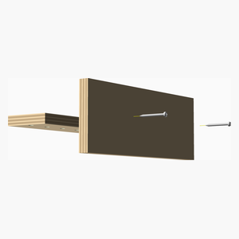

# Screwdrivers Store

screwdrivers support

It's my first project in OpenSCAD. I wanted to create a support for my screwdrivers.

---
## Table of Contents
1. [Parts list](#Parts_list)
1. [Wall Frenchcleat Assembly](#wall_frenchcleat_assembly)
1. [Screwdriver Support Assembly](#screwdriver_support_assembly)
1. [Wall Support Assembly](#wall_support_assembly)
1. [Support Assembly](#support_assembly)
1. [Frenchcleat Assembly](#frenchcleat_assembly)
1. [Main Assembly](#main_assembly)

[Top](#TOP)

---

## Parts list
| Wall&nbsp;Frenchcleat | Screwdriver&nbsp;Support | Support | Frenchcleat | Main | TOTALS |  |
|---:|---:|---:|---:|---:|---:|:---|
|  |  |  |  |  | | **Vitamins** |
| &nbsp;&nbsp;1&nbsp; | &nbsp;&nbsp;.&nbsp; | &nbsp;&nbsp;.&nbsp; | &nbsp;&nbsp;.&nbsp; | &nbsp;&nbsp;.&nbsp; |  &nbsp;&nbsp;1&nbsp; | &nbsp;&nbsp; Bottom french cleat optimised 280x50x15 |
| &nbsp;&nbsp;.&nbsp; | &nbsp;&nbsp;.&nbsp; | &nbsp;&nbsp;.&nbsp; | &nbsp;&nbsp;2&nbsp; | &nbsp;&nbsp;.&nbsp; |  &nbsp;&nbsp;2&nbsp; | &nbsp;&nbsp; Screw 6-32 pan x 25mm |
| &nbsp;&nbsp;.&nbsp; | &nbsp;&nbsp;.&nbsp; | &nbsp;&nbsp;2&nbsp; | &nbsp;&nbsp;.&nbsp; | &nbsp;&nbsp;.&nbsp; |  &nbsp;&nbsp;2&nbsp; | &nbsp;&nbsp; Screw 6-32 pan x 40mm |
| &nbsp;&nbsp;.&nbsp; | &nbsp;&nbsp;.&nbsp; | &nbsp;&nbsp;.&nbsp; | &nbsp;&nbsp;.&nbsp; | &nbsp;&nbsp;1&nbsp; |  &nbsp;&nbsp;1&nbsp; | &nbsp;&nbsp; Screwdriver 210x100 |
| &nbsp;&nbsp;.&nbsp; | &nbsp;&nbsp;.&nbsp; | &nbsp;&nbsp;.&nbsp; | &nbsp;&nbsp;.&nbsp; | &nbsp;&nbsp;2&nbsp; |  &nbsp;&nbsp;2&nbsp; | &nbsp;&nbsp; Screwdriver 210x100 |
| &nbsp;&nbsp;.&nbsp; | &nbsp;&nbsp;.&nbsp; | &nbsp;&nbsp;.&nbsp; | &nbsp;&nbsp;.&nbsp; | &nbsp;&nbsp;1&nbsp; |  &nbsp;&nbsp;1&nbsp; | &nbsp;&nbsp; Screwdriver 240x125 |
| &nbsp;&nbsp;.&nbsp; | &nbsp;&nbsp;.&nbsp; | &nbsp;&nbsp;.&nbsp; | &nbsp;&nbsp;.&nbsp; | &nbsp;&nbsp;1&nbsp; |  &nbsp;&nbsp;1&nbsp; | &nbsp;&nbsp; Screwdriver 270x150 |
| &nbsp;&nbsp;.&nbsp; | &nbsp;&nbsp;.&nbsp; | &nbsp;&nbsp;1&nbsp; | &nbsp;&nbsp;.&nbsp; | &nbsp;&nbsp;.&nbsp; |  &nbsp;&nbsp;1&nbsp; | &nbsp;&nbsp;7 Plies plywood plank 280x100x15mm |
| &nbsp;&nbsp;.&nbsp; | &nbsp;&nbsp;1&nbsp; | &nbsp;&nbsp;.&nbsp; | &nbsp;&nbsp;.&nbsp; | &nbsp;&nbsp;.&nbsp; |  &nbsp;&nbsp;1&nbsp; | &nbsp;&nbsp;7 Plies plywood plank 280x70x15mm |
| &nbsp;&nbsp;1&nbsp; | &nbsp;&nbsp;.&nbsp; | &nbsp;&nbsp;.&nbsp; | &nbsp;&nbsp;.&nbsp; | &nbsp;&nbsp;.&nbsp; |  &nbsp;&nbsp;1&nbsp; | &nbsp;&nbsp;7 Plies plywood plank 50x280x15mm |
| &nbsp;&nbsp;2&nbsp; | &nbsp;&nbsp;1&nbsp; | &nbsp;&nbsp;3&nbsp; | &nbsp;&nbsp;2&nbsp; | &nbsp;&nbsp;5&nbsp; | &nbsp;&nbsp;13&nbsp; | &nbsp;&nbsp;Total vitamins count |

[Top](#TOP)

---

## Wall Frenchcleat Assembly
### Vitamins
|Qty|Description|
|---:|:----------|
|1| Bottom french cleat optimised 280x50x15|
|1|7 Plies plywood plank 50x280x15mm|

### Assembly instructions

1. cut the plywood and external cut at 45°

[Top](#TOP)

---

## Screwdriver Support Assembly
### Vitamins
|Qty|Description|
|---:|:----------|
|1|7 Plies plywood plank 280x70x15mm|

### Assembly instructions

1. cut the plywood
1. drill holes

[Top](#TOP)

---

## Wall Support Assembly
### Vitamins
|Qty|Description|
|---:|:----------|
|1|7 Plies plywood plank 280x100x15mm|

### Assembly instructions

[Top](#TOP)

---

## Support Assembly
### Vitamins
|Qty|Description|
|---:|:----------|
|2| Screw 6-32 pan x 40mm|

### Sub-assemblies

| 1 x screwdriver_support_assembly | 1 x wall_support_assembly |
|---|---|
|  |  

### Assembly instructions

1. Center the screwdriver support on the wall support
1. Tighten screws

[Top](#TOP)

---

## Frenchcleat Assembly
### Vitamins
|Qty|Description|
|---:|:----------|
|2| Screw 6-32 pan x 25mm|

### Sub-assemblies

| 1 x support_assembly | 1 x wall_frenchcleat_assembly |
|---|---|
|  |  

### Assembly instructions

1. Attach french cleat to the wall

[Top](#TOP)

---

## Main Assembly
### Vitamins
|Qty|Description|
|---:|:----------|
|1| Screwdriver 210x100|
|2| Screwdriver 210x100|
|1| Screwdriver 240x125|
|1| Screwdriver 270x150|

### Sub-assemblies

| 1 x frenchcleat_assembly |
|---|
|  

### Assembly instructions

Assembly instructions in Markdown format in front of each module that makes an assembly.

[Top](#TOP)
