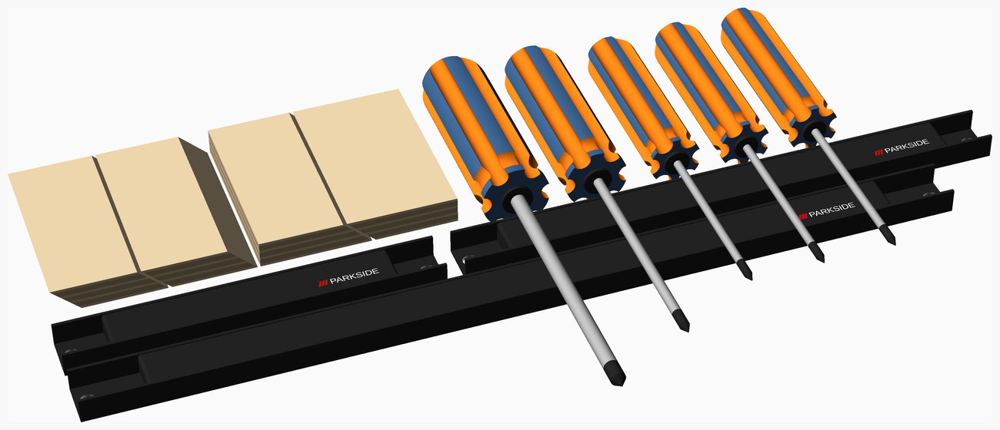
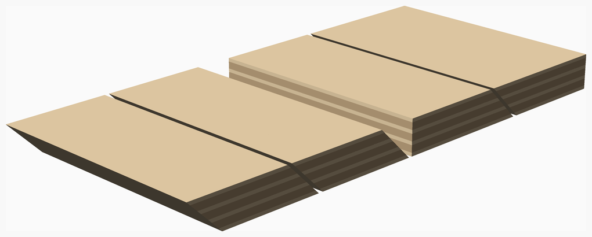
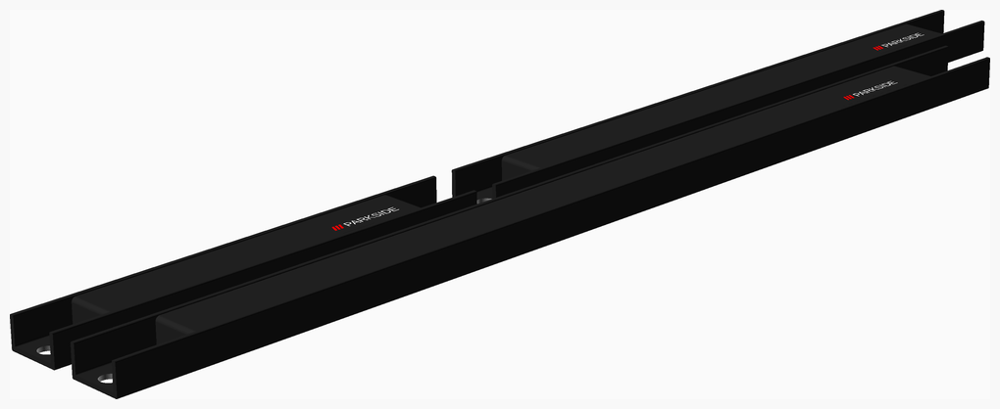
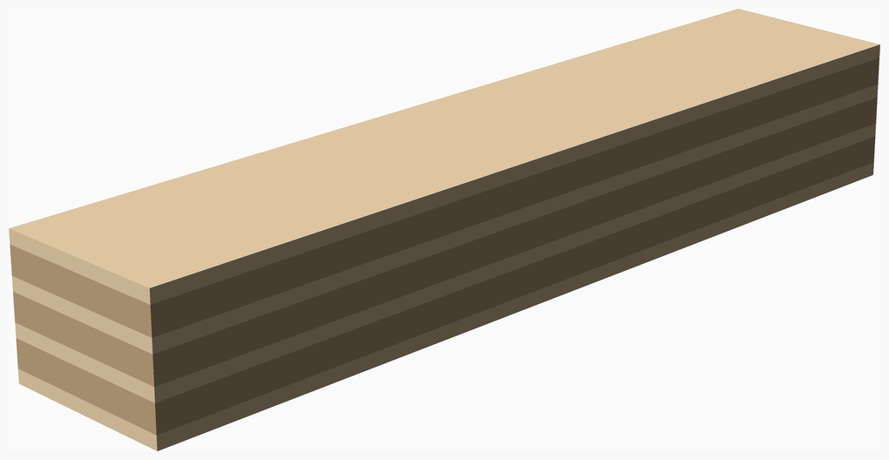

# CADLibrary

I would share here my OpenSCAD designs, generally related to woodworking.

I draw inspiration from the excellent [NopSCADlib](https://github.com/nophead/NopSCADlib) project by nophead.

 

## Table of Contents<a name="top"/>
<table><tr>
<th align="left"> Vitamins A-H </th><th align="left"> Vitamins I-Q </th><th align="left"> Vitamins R-Z </th></tr>
<tr><td> <a href = "#french_cleats">French_cleats</a> </td><td> <a href = "#magnet_bars">Magnet_bars</a> </td><td></td></tr>
<tr><td></td><td> <a href = "#plywoods">Plywoods</a> </td><td></td></tr>
</table>

---

## French_cleats
French Cleat

[vitamins/french_cleats.scad](vitamins/french_cleats.scad) Object definitions.

[vitamins/french_cleat.scad](vitamins/french_cleat.scad) Implementation.

[tests/french_cleats.scad](tests/french_cleats.scad) Code for this example.

### Modules
| Module | Description |
|:--- |:--- |
| `french_cleat(type, width, height, depth, bottom = true, nb_ply = 7)` | Draw a french cleat |

### Vitamins
| Qty | Module call | BOM entry |
| ---:|:--- |:---|
|   1 | `french_cleat(opt,100,60,15,true)` |  Bottom french cleat optimised 100x60x15 |
|   1 | `french_cleat(std,100,60,15,true)` |  Bottom french cleat standard 100x60x15 |
|   4 | `plywood_plank(7,60,100,15)` |  Plywood plank |
|   1 | `french_cleat(opt,100,60,15,false)` |  Top french cleat optimised 100x60x15 |
|   1 | `french_cleat(std,100,60,15,false)` |  Top french cleat standard 100x60x15 |

<a href="#top">Top</a>

---

## Magnet_bars
Parkside Magnetic bar

[vitamins/magnet_bars.scad](vitamins/magnet_bars.scad) Object definitions.

[vitamins/magnet_bar.scad](vitamins/magnet_bar.scad) Implementation.

[tests/magnet_bars.scad](tests/magnet_bars.scad) Code for this example.

### Properties
| Function | Description |
|:--- |:--- |
| `mth_depth(type)` | magnetbar depth |
| `mth_height(type)` | magnetbar height |
| `mth_metaltickness(type)` | magnetbar metaltickness |
| `mth_padding(type)` | magnetbar padding |
| `mth_width(type)` | magnetbar width |

### Modules
| Module | Description |
|:--- |:--- |
| `magnet_bar(type)` | Draw a parkside magnet bar |

### Vitamins
| Qty | Module call | BOM entry |
| ---:|:--- |:---|
|   1 | `magnet_bar(magnetbar_200)` |  Magnetbar 200 wdith |
|   1 | `magnet_bar(magnetbar_300)` |  Magnetbar 300 width |
|   1 | `magnet_bar(magnetbar_470)` |  Magnetbar 470 width |

<a href="#top">Top</a>

---

## Plywoods
Plywood plank

[vitamins/plywood.scad](vitamins/plywood.scad) Implementation.

[tests/plywoods.scad](tests/plywoods.scad) Code for this example.

### Modules
| Module | Description |
|:--- |:--- |
| `plywood_plank(nb_ply, width, height, depth)` | Draw a plywood plank |

### Vitamins
| Qty | Module call | BOM entry |
| ---:|:--- |:---|
|   1 | `plywood_plank(7,100,20,15)` |  Plywood plank |

<a href="#top">Top</a>

---
