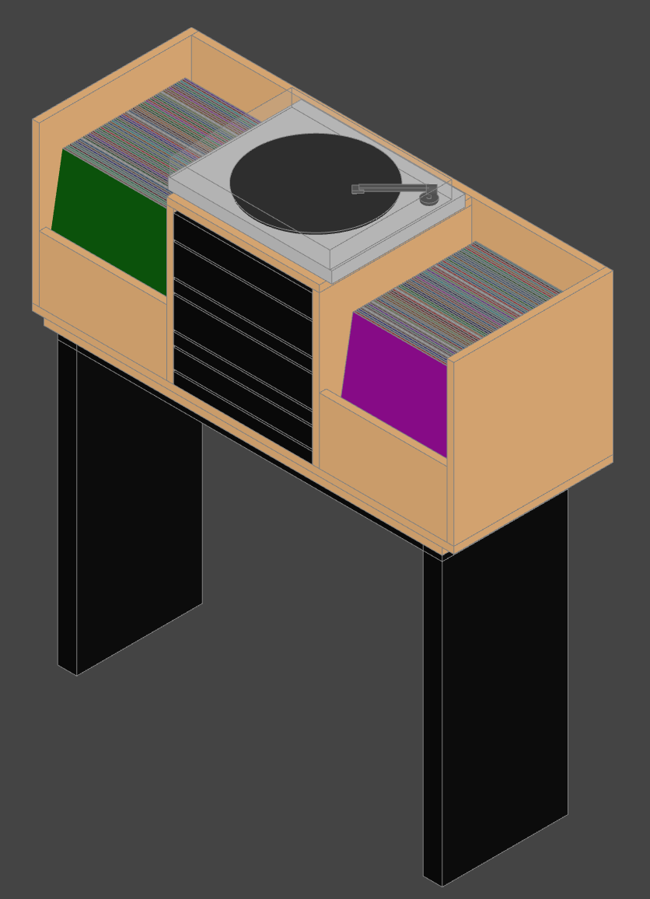
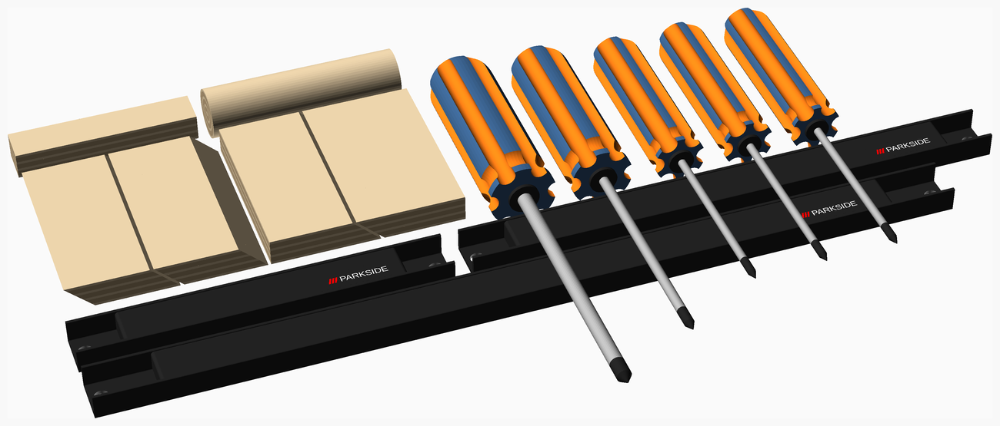
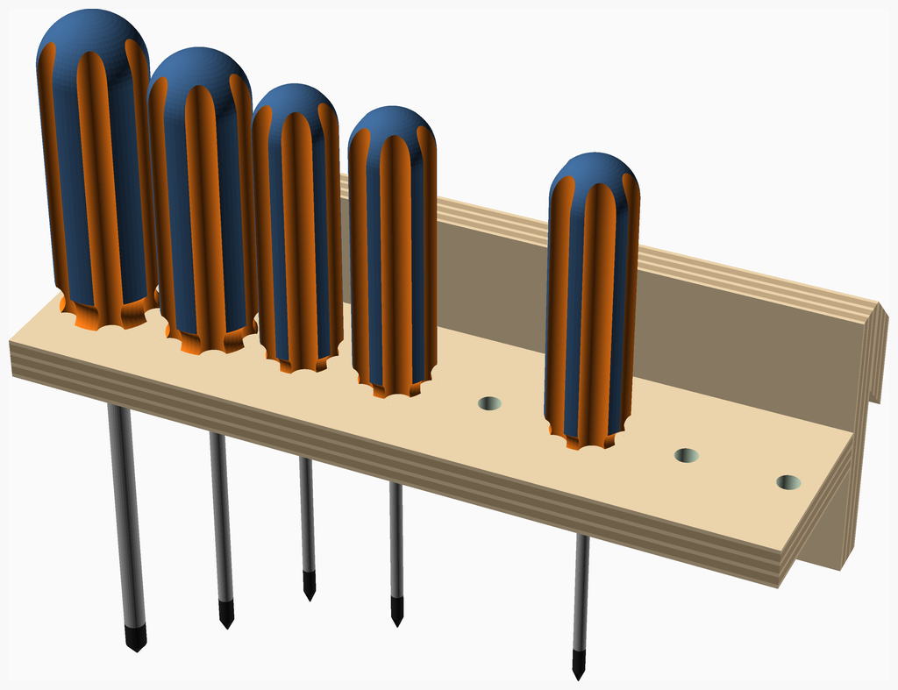
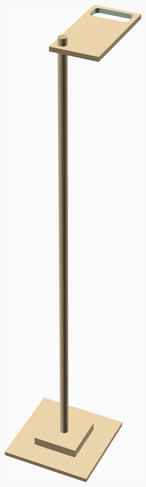
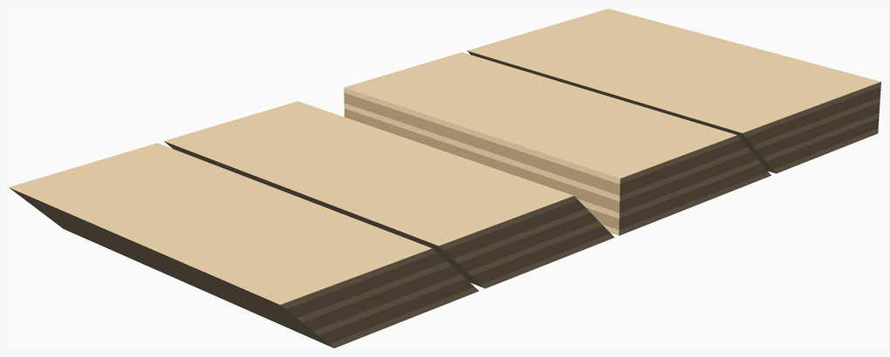
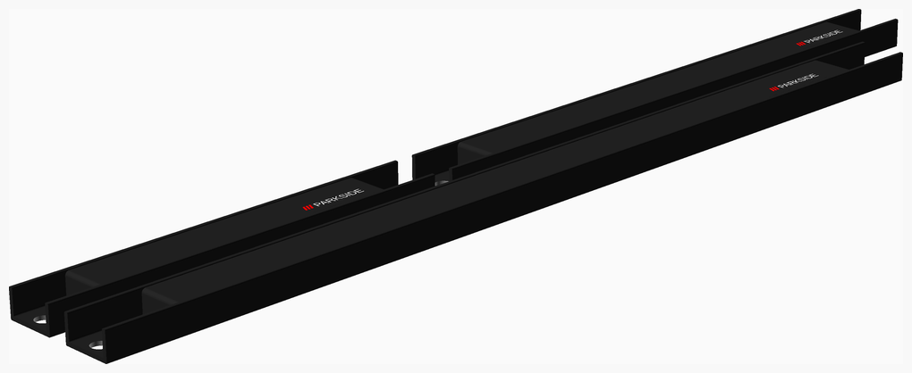
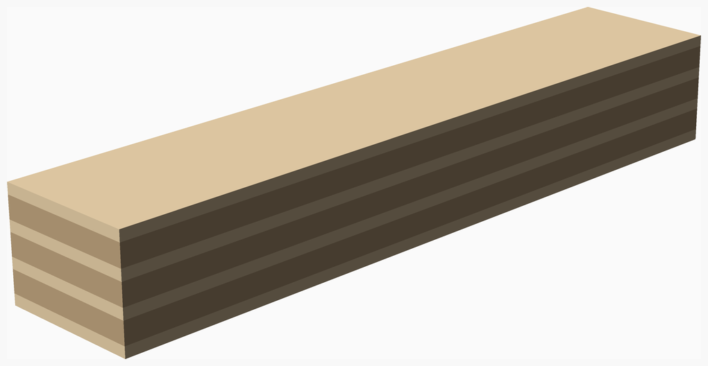
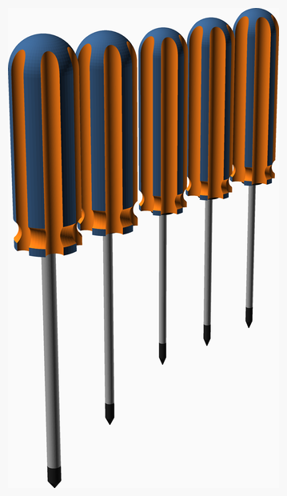
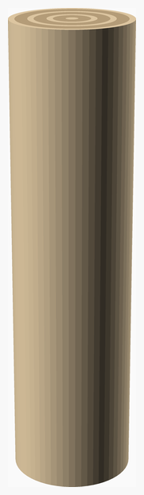

# CADLibrary

I would share here my `OpenSCAD` and `build123d` designs, generally related to woodworking.

## build123d



| Qty | Thickness | Dimensions (mm)   | Labels                                 |
| --: | --------: | :---------------- | :------------------------------------- |
|   2 |     18 mm | 172.5 mm x 335 mm | gauche_facade, droite_facade           |
|   1 |     18 mm | 366 mm x 1046 mm  | socle                                  |
|   2 |     18 mm | 400 mm x 400 mm   | gauche_hifi, droite_hifi               |
|   1 |     18 mm | 400 mm x 401 mm   | support_platine                        |
|   2 |     18 mm | 418 mm x 418 mm   | gauche, droite                         |
|   1 |     18 mm | 418 mm x 1071 mm  | fond                                   |
|   1 |     18 mm | 418 mm x 1107 mm  | base                                   |
|   2 |     50 mm | 330 mm x 790 mm   | meuble_noir_gauche, meuble_noir_droite |
|   1 |     50 mm | 330 mm x 1010 mm  | meuble_noir_plateau                    |

## OpenSCAD

### Installation

Install requirements

- `direnv` - direnv execute a command when enter on this folder project
- `nix` package manager for all systems ( Linux, MacOS, Windows)

Once `direnv` and `nix` are installed, you just need to enter the project directory,
and then this project will configure itself automatically (see bellow tasks)

- Clone the NoptCADlib repository
- Install requirement packages
- Create python virtualenv

### Usage

```bash
just inventories # Generate all vitamins
just projects    # Generate all projects
```

 

### Projects

|                                                                                            |                                                                                |
| ------------------------------------------------------------------------------------------ | ------------------------------------------------------------------------------ |
|  |  |
| [screwdrivers store](./openscad/projects/screwdrivers_store)                               | [phone holder](./openscad/projects/phone_holder)                               |

### Table of Contents<a name="top"/>

<table><tr>
<th align="left"> Vitamins A-H </th><th align="left"> Vitamins I-Q </th><th align="left"> Vitamins R-Z </th></tr>
<tr><td> <a href = "#french_cleats">French_cleats</a> </td><td> <a href = "#magnet_bars">Magnet_bars</a> </td><td> <a href = "#screwdrivers">Screwdrivers</a> </td></tr>
<tr><td></td><td> <a href = "#plywoods">Plywoods</a> </td><td> <a href = "#wood_cylinder">Wood_cylinder</a> </td></tr>
</table>

---

<a name="french_cleats"></a>

### French_cleats

French Cleat

[vitamins/french_cleats.scad](vitamins/french_cleats.scad) Object definitions.

[vitamins/french_cleat.scad](vitamins/french_cleat.scad) Implementation.

[openscad/tests/french_cleats.scad](tests/french_cleats.scad) Code for this example.

#### Modules

| Module                                                                | Description         |
| :-------------------------------------------------------------------- | :------------------ |
| `french_cleat(type, width, height, depth, bottom = true, nb_ply = 7)` | Draw a french cleat |



#### Vitamins

| Qty | Module call                         | BOM entry                               |
| --: | :---------------------------------- | :-------------------------------------- |
|   1 | `french_cleat(opt,100,60,15,true)`  | Bottom french cleat optimised 100x60x15 |
|   1 | `french_cleat(std,100,60,15,true)`  | Bottom french cleat standard 100x60x15  |
|   1 | `french_cleat(opt,100,60,15,false)` | Top french cleat optimised 100x60x15    |
|   1 | `french_cleat(std,100,60,15,false)` | Top french cleat standard 100x60x15     |
|   4 | `plywood_plank(7,60,100,15)`        | 7 Plies plywood plank 60x100x15mm       |

<a href="#top">Top</a>

---

<a name="magnet_bars"></a>

### Magnet_bars

Parkside Magnetic bar

[vitamins/magnet_bars.scad](vitamins/magnet_bars.scad) Object definitions.

[vitamins/magnet_bar.scad](vitamins/magnet_bar.scad) Implementation.

[openscad/tests/magnet_bars.scad](tests/magnet_bars.scad) Code for this example.

#### Properties

| Function                  | Description             |
| :------------------------ | :---------------------- |
| `mth_depth(type)`         | magnetbar depth         |
| `mth_height(type)`        | magnetbar height        |
| `mth_metaltickness(type)` | magnetbar metaltickness |
| `mth_padding(type)`       | magnetbar padding       |
| `mth_width(type)`         | magnetbar width         |

#### Modules

| Module             | Description                |
| :----------------- | :------------------------- |
| `magnet_bar(type)` | Draw a parkside magnet bar |



#### Vitamins

| Qty | Module call                 | BOM entry           |
| --: | :-------------------------- | :------------------ |
|   1 | `magnet_bar(magnetbar_200)` | Magnetbar 200 wdith |
|   1 | `magnet_bar(magnetbar_300)` | Magnetbar 300 width |
|   1 | `magnet_bar(magnetbar_470)` | Magnetbar 470 width |

<a href="#top">Top</a>

---

<a name="plywoods"></a>

### Plywoods

Plywood plank

[vitamins/plywood.scad](vitamins/plywood.scad) Implementation.

[openscad/tests/plywoods.scad](tests/plywoods.scad) Code for this example.

#### Modules

| Module                                        | Description          |
| :-------------------------------------------- | :------------------- |
| `plywood_plank(nb_ply, width, height, depth)` | Draw a plywood plank |



#### Vitamins

| Qty | Module call                  | BOM entry                         |
| --: | :--------------------------- | :-------------------------------- |
|   1 | `plywood_plank(7,100,20,15)` | 7 Plies plywood plank 100x20x15mm |

<a href="#top">Top</a>

---

<a name="screwdrivers"></a>

### Screwdrivers

Screwdriver

[vitamins/screwdriver.scad](vitamins/screwdriver.scad) Implementation.

[openscad/tests/screwdrivers.scad](tests/screwdrivers.scad) Code for this example.

#### Modules

| Module                                                                               | Description        |
| :----------------------------------------------------------------------------------- | :----------------- |
| `screwdriver(total_height, tool_height, max_diam, min_diam, washer_diam, tool_diam)` | Draw a screwdriver |



#### Vitamins

| Qty | Module call                              | BOM entry           |
| --: | :--------------------------------------- | :------------------ |
|   1 | `screwdriver(210,100,28.5,19,14.2,4.5,)` | Screwdriver 210x100 |
|   2 | `screwdriver(210,100,28.5,19,13.5,4.5,)` | Screwdriver 210x100 |
|   1 | `screwdriver(240,125,34.5,23,15.5,5.5,)` | Screwdriver 240x125 |
|   1 | `screwdriver(270,150,37.5,25,17,8,)`     | Screwdriver 270x150 |

<a href="#top">Top</a>

---

<a name="wood_cylinder"></a>

### Wood_cylinder

Wood cylinder

[vitamins/wood_cylinder.scad](vitamins/wood_cylinder.scad) Implementation.

[openscad/tests/wood_cylinder.scad](tests/wood_cylinder.scad) Code for this example.

#### Modules

| Module                                    | Description          |
| :---------------------------------------- | :------------------- |
| `wood_cylinder(nb_ply, height, diameter)` | Draw a wood cylinder |



#### Vitamins

| Qty | Module call               | BOM entry                       |
| --: | :------------------------ | :------------------------------ |
|   1 | `wood_cylinder(7,108,28)` | 7 Plies wood cylinder 108x28 mm |

<a href="#top">Top</a>

---

## Source:

- I draw inspiration from the excellent [NopSCADlib](https://github.com/nophead/NopSCADlib) project by nophead.
